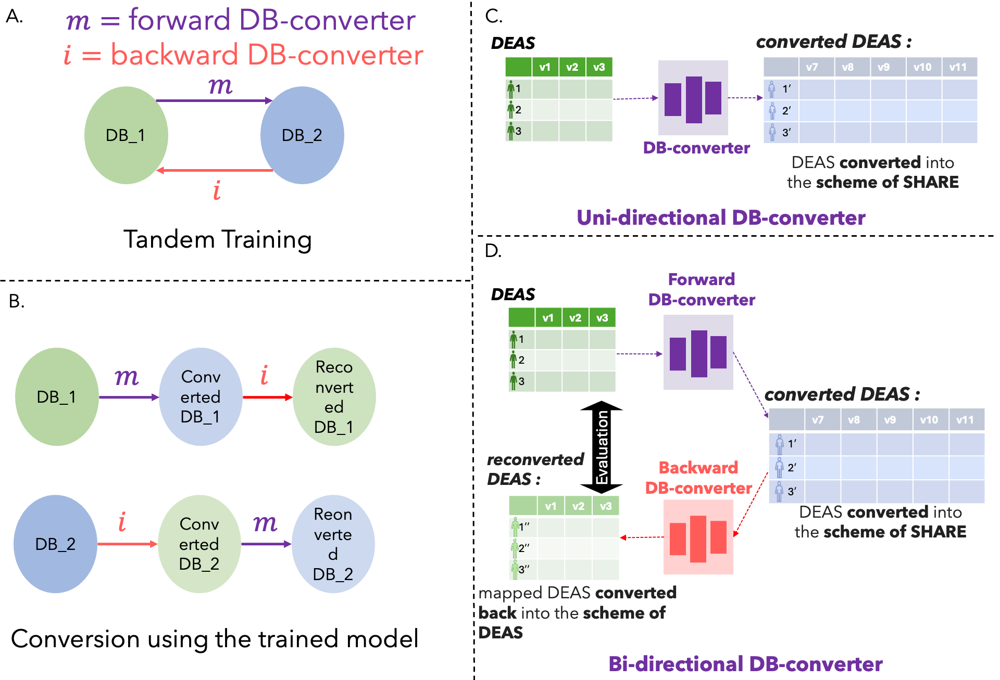

# Bi-directional DB-converter 
This GitHub repository contains the tool used in the paper titled **Self-supervised generative AI enables conversion of two non-overlapping cohorts** - **Das. S et. al.** It is a self-supervised deep learning architecture leveraging category theory designed to convert data from different cohorts with different data structures into each other. This takes input of the starting (DB1) and target data(DB2) in train, dev, and test splits, and outputs a trained model which contains weights and biases for both the forward DB-converter ($m$) and backward DB-converter ($i$). Based on the provided test set of DB1 and DB2, it also outputs $m(DB_1)$ as Converted-DB1 (which is in $DB_2$ scheme), $i(m(DB_1)$ as Reconverted-DB1, $i(DB_2)$ as Converted-DB2(which is in $DB_1$ scheme) and $m(i(DB_2)$ as reconverted DB_2. 

A. During training, the train and dev sets of two databases, DB1 and DB2, are use,d where the goal is to convert DB1 to the DB2 scheme and vice versa. B. After trsined we take trained $m$ and $i$ to produce converted ones and also nested functions $i \circ m$ and $m \circ i$ to produce the reconverted ones, in ideal case starting dataset and reconverted should be same, as $m$ approximates functor $\mathscr{F}$ and $i$ approximated $\mathscr{G}$ which is right and left inverse of $\mathscr{F}$. C. The uni-directional DB-converter uses one neural network to approximate a functor that converts the DB1 ( here DEAS database)  into the DB2 (here SHARE) scheme. D. The bi-directional DB-converter uses two neural networks, a Forward DB-converter and a Backward DB-converter, for training without the loss approximation technique. The forward and Backward DB-converter are trained in tandem, back and forth. For C. and D., we use DEAS and SHARE as examples for two databases. 
 
# How to use DB-converter
We deploy this app in 3 possible ways. 1. This GitHub (one needs to set up one's own environment) 2. Google collab (one doesn't need to set up the environment) 3. Docker image version (one doesn't need to set up the environment). 

# Clone Repo
`git clone https://github.com/Mycheaux/DB-conv.git`

# Solution 1: Directly run this Github repo

## Environment Set up:
We currently provide both CPU and GPU (NVIDIA) support. The app is tested on a Mac M1 CPU environment and Linux GPU cluster.
If you are on Windows and find errors due to the path due to `/` vs \' you may try the following fix:You can create a batch script that automatically translates paths with / into \ before passing them to tools that require backslashes. For example:
```
@echo off

set "input_path=%1"

set "converted_path=%input_path:/=\%"

echo %converted_path%
```
If you prefer not to deal with Windows path quirks, you can run your repository in a Unix-like environment such as Windows Subsystem for Linux (WSL),Git Bash.

### Python Libraries:
We assume we already have Anaconda or miniconda; if not, check here how to get one. https://www.anaconda.com/download or https://www.anaconda.com/docs/getting-started/miniconda/main

1. Best, most general way:
```
conda create --name db-conv python=3.12 -y
conda activate db-conv
conda install pip -y
conda install numpy scipy pandas -y
conda install -c conda-forge pyyaml
```
   Now, install either cpu or the GPU version of PyTorch
   
   CPU version:
   
     conda install pytorch=2.5.1 torchvision torchaudio cpuonly -c pytorch  # CPU-only
   
   GPU version:
   
     pip3 install torch==2.6.0  # GPU-only #conda is removed
     
   Now, install the lightning API and weights and biases
```
conda install lightning -c conda-forge
conda install wandb -c conda-forge
```
This method works in general (tested on Mac M1 2021 and in a Linux server). If it doesn't work, try the following options to make sure you have the exact versions of PyTorch, depending on the availability of CUDA devices. 

2. In general, for any CPU environment, you should first create a fresh conda environment using
```
conda create --name db-conv python=3.12 -y
conda activate db-conv
conda install pip -y
```
and install all packages
   
     pip install -r cpu_requirements.txt
     
   This method breaks when pip can't find the right version, try the conda alternative as suggested above.
   
3. In general, for any devices with an available CUDA-supported NVIDIA GPU, you should first create a fresh conda environment using

```
conda create --name db-conv python=3.12 -y
conda activate db-conv
conda install pip -y
pip install -r gpu_requirements.txt
```
   This method breaks when pip can't find the right version, try the conda alternative as suggested above.

4. If you are using a Mac M1 2021, try this if you encounter dependency problems in the general way. 

     conda env create -f m1cpu_environment.yml
  
Then from the activated environment

     pip freeze > m1cpu_requirements.txt  # From within activated environment
  
  This method breaks when pip can't find the right version, try the conda alternative as suggested above.

## Weights and Biases API:
You require a weights and bias account to monitor your Model training. Make a free account here: https://wandb.ai/site, and find your API key in your settings after logging in. When the app starts, it will ask for your API key to log in, and the App with create loss function plots during training.

## Configs:
1. Data path and names of DB1's train, dev, test (referred as x_train, x_val, x_test) respectively, and DB2's train, dev, test (referred as y_train, y_val, y_test), are to be given in `data_path.yml`. Alterntively, you can also replace/create the input files in 'data/preprocessed' folder with following names `za_train.npy`,`za_val.npy`,`za_test.npy` for x_train, x_val, x_test or `zb_train.npy`,`zb_val.npy`,`zb_test.npy`for y_train, y_val, y_test. This only expects data in `.npy` format. 
2. `config.yaml` has most commonly tuned hyperparameters and options for the output folder's name and experiment name details.
3. `architecture.yaml` has parameters on architecture input and output size details. Make sure your data, your architecture of $m$ (referred as mapper in the code), $i$ (referred as inverter in the code), given in `scr/model.py`, and details in this config match.
4. `advanced_config.yaml` has some more hyperparameters which are rarely changed.
   
## Data:
The code expects all data in either `.npy` or `.csv` format. If you don't have it in this format, here is how you can convert your data into `.npy` format. 
1. Read your data into pandas dataframe. e.g. `df = pd.read_excel('your_file.xlsx',skiprows=1)`
2. Convert it to `df_numpy = df.to_numpy()`.
3. Save it using `np.save('your_file_path/your_file.npy', df_numpy)`
   
*Note: For a `.csv` file, we assume the first row is column names, and that's why it's skipped. If you need it, either add a false first row or remove the tag 'skiprows=1' from the `load_data` function in `src/data_loader.py` and `test/test_data_loader.py`. 

The sample size of x_train, x_val, x_test should match that of y_train, y_val, y_test respectively. If not, you can preprocess them by subsampling the bigger database to the size of the smaller one. e.g.
```
smaller_size = min(x.shape[0], y.shape[0]) # x = whole DB1, y = whole DB2
x_subsampled = x_train[:smaller_size]
y_subsampled = y_train[:smaller_size]
```
The feature size of x_train, x_val, and x_test should be the same with each other (all coming from the same database DB1). The feature size of y_train, y_val, and y_test should be the same as each other (all coming from the same database DB2). 
Here is an example to split the data into train, dev, and test sets if your data is not already split. 
```
import numpy as np

# Assuming x and y are NumPy arrays
x = np.load('path_to_x.npy')  # Replace with your actual file path
y = np.load('path_to_y.npy')  # Replace with your actual file path

# Ensure x and y have the same sample size
assert x.shape[0] == y.shape[0], "x and y must have the same number of samples!"

# Shuffle the data (optional, but recommended)
indices = np.arange(x.shape[0])
np.random.shuffle(indices)
x = x[indices]
y = y[indices]

# Split the data into 90% train, 10% dev, 10% test
train_size = int(0.9 * len(x))
dev_size = int(0.1 * len(x))

x_train, x_dev, x_test = x[:train_size], x[train_size:train_size+dev_size], x[train_size+dev_size:]
y_train, y_dev, y_test = y[:train_size], y[train_size:train_size+dev_size], y[train_size+dev_size:]

# Save the datasets
np.save('x_train.npy', x_train)
np.save('x_dev.npy', x_dev)
np.save('x_test.npy', x_test)
np.save('y_train.npy', y_train)
np.save('y_dev.npy', y_dev)
np.save('y_test.npy', y_test)

print("Data successfully split into train, dev, and test sets!")

```
## architecture:
Based on input, output size, and datatype in each scenario, you would need to design your own forward DB-converter / mapper / $m$ and backward DB-converter / interter / $i$. These two architectures should be in `src/model.py` with the same class name, written with PyTorch Lightning's `pl.LightningModule`. Do you want to convert your PyTorch code to the lightning api? check here : [https://lightning.ai/docs/fabric/2.4.0/#](https://lightning.ai/docs/pytorch/stable/starter/introduction.html) , https://lightning.ai/blog/pytorch-lightning-upgrade-faq/
Have  TensorFlow code and want to convert it into PyTorch? You can find many AI-based code converters to move from TensorFlow to PyTorch. 

### architecture wisdom:
Use the exact reverse architecture of $m$ for $i$. 
If training suggests one is stronger than the other, you may try regularization, or you may train one agent more times than the other, change it in 'config.yaml' at `mapper_repeat`, `inverter_repeat` for $m$ and $i$ respectively. In each epoch $m$ runs `mapper_repeat` times and $i$ runs `inverter_repeat` times. 

### hyperparameter tuning wisdom:
Check the plots and change the loss component weightage.
$m$/ forward DB-converter / `mapper` and $i$ /backward DB-converter / `inverter` should converge ideally at a similar speed. Otherwise, one is more powerful than the other. 
The total loss of $m$ is called `mapping_loss` and the total loss of $i$ is called `inverting_loss`. Here are the components of the loss. 
`l1_loss` = $L_1$ distance
`l2_loss` = $L_2$ distance
`tji_loss` = NTL (neighbourhood topology loss)
`hce_loss`= HC entropy loss component
`pt_loss` = cosine similarity loss
batch_size: A bigger batch size helps, but on GPU it might be limited by VRAM.


## Run Training and Inference:
**For training followed by inference**, in the terminal, within an activated environment where all necessary libraries (yalm, numpy, scipy, pandas, pytorch, lightning, wandb ) are installed, run the following 
`python3 main.py`

**For inference alone**, after you have at least once run the training or have preexisting model checkpoints, run the following
`python3 inference.py`

It will ask for a wandb API, paste your api, and hit enter. 

## Monitor the training progress:
Log in to your weights and bias account, go to the project tab, and you will find a project named the same as the name you provided in `config.yaml` at `project_name`. This will have all the plots being plotted in real time as your model gets trained; each model will be named the same as  the name you provided in `config.yaml` at `model_name`. During training, each $n$ epochs (as defined in `config.yaml`), it will save the models in `output/models/project_name/model_name`.

## Model inference / Converted and reconverted data generation:
It will automatically load the model and epoch you specify in the `config.yaml`, and produce the results and save them in the path specified in `config.yaml`, which is by default in `output/data`. 
 $m(DB_1)$ as Converted-DB1 (which is in $DB_2$ scheme) := `DB-A_converted.npy`
 $i(m(DB_1)$ as Reconverted-DB1 := `DB-A_reconverted.npy`
 $i(DB_2)$ as Converted-DB2(which is in $DB_1$ scheme) := `DB-B_converted.npy`
 $m(i(DB_2)$ as reconverted DB_2  := `DB-B_reconverted.npy`

## Notes:
Currently, the `requirement.txt` is ignored; you can reactivate it from `main.py`. This slows down the process. Hence, it is better to install them separately during the first setup. 

# Solution 2: Run on Google Colab:
To run in Google Colab, please go to `ipynb_notebooks/ipynb_notebooks.zip`, download the zip file and unzip it, and find the `KT_2agent_syn_cont.ipynb` file.

Then go to https://colab.research.google.com/ and sign in, go to `file` $rightarrow$ `upload notebook`, and upload the aforementioned file.

Now, after uploading, run each cell one by one. 

To utilize the GPU, connect with a GPU runtime. Here you will also need Weights and Biases API (see above). KT_2agent_syn_cont.ipynb generates synthetic datasets and performs  an experiment on them. However, for your use case, check the `Data` section above to import your data in `.npy` or `.csv` format. 


# Solution 3: via Docker : 
**further testing is required**

## Docker only

Get the docker image using this `docker pull mycheaux/db-converter:1.0`.

Get the image runing `docker run -it db-converter`.

You can specify config, input, and output volumes as follows and provide the required files as demonstrated in this repository:

```
docker run -v ./config:/app/config -v ./output:/app/output -v ./data:/app/ data db-converter
```

To support the use of CUDA inside Docker you will first need to set up the Nvidia container toolkit as described [here](https://docs.nvidia.com/datacenter/cloud-native/container-toolkit/latest/install-guide.html).

After that, docker can be run with cuda support as follows:

```
docker run -v ./config:/app/config -v ./output:/app/output -v ./data:/app/data --runtime=nvidia --gpus all db-converter

```

## Docker compose

For the ease of use we further provide a `docker-compose.yml` in this repository. You can either copy it to your local system or just clone the whole repository, as described earlier. CUDA support is enabled by default, so make sure you prepared your execution system as described in the Docker only block above, or remove everyting including and after the `deploy:` key in the docker-compose file.

To adjust config, input, and output directory you can edit the left side of the volume declaration in the docker-compose file:

```yaml
volumes:
  - $config_directory:/app/config
  - $output_directory:/app/output
  - $data_directory:/app/data
```

NOTE: Do not adjust these top-level directories using the config files, as that will create a missmatch with where the docker-compose volumes will be mounted to!


If you want to use Weights & Biases to monitor the training progress and do want to provide the API key through the adequate config file you will have to launch the docker container in interactive mode:

```bash
docker compose run --rm db-conv
```

Otherwise, if you either specify your API key through the config file or do not want to connect to Weights & Biases at all you can simply one of the following commands:


To run in the background:
```bash
docker compose up -d
```


To run in attached mode:
```bash
docker compose up
```


